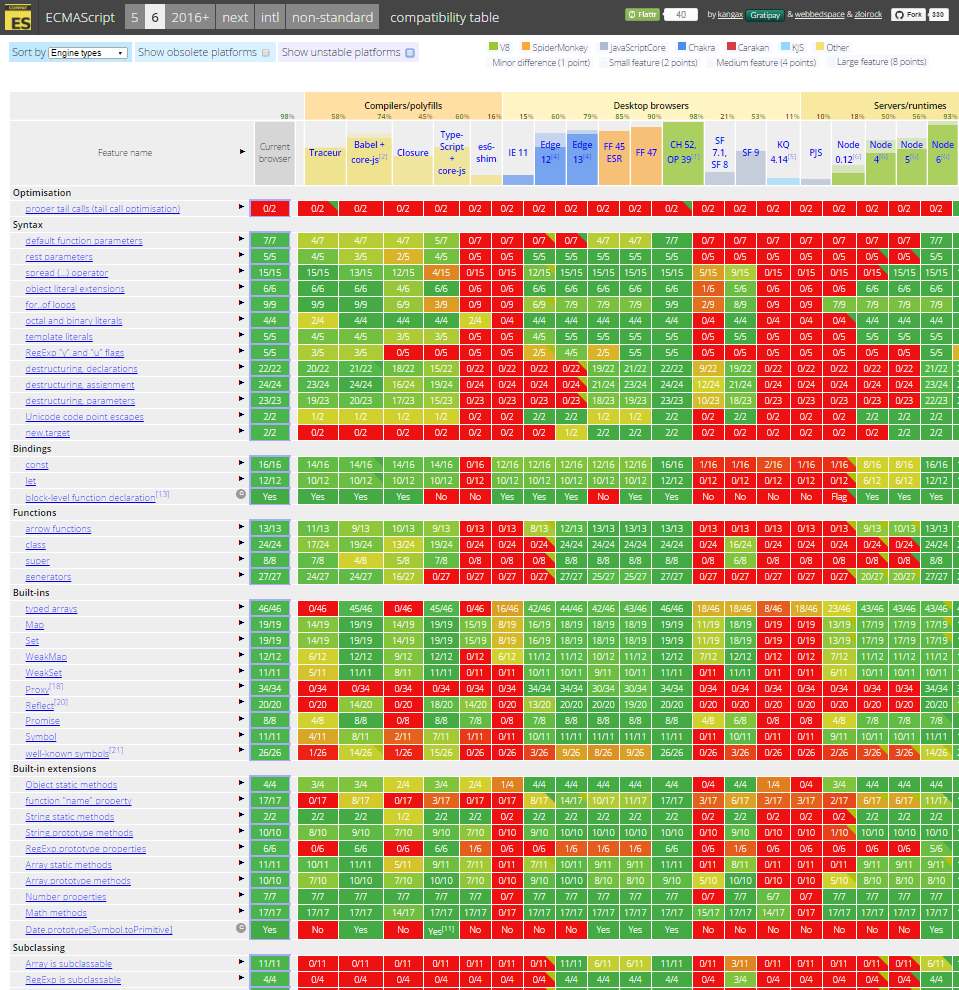
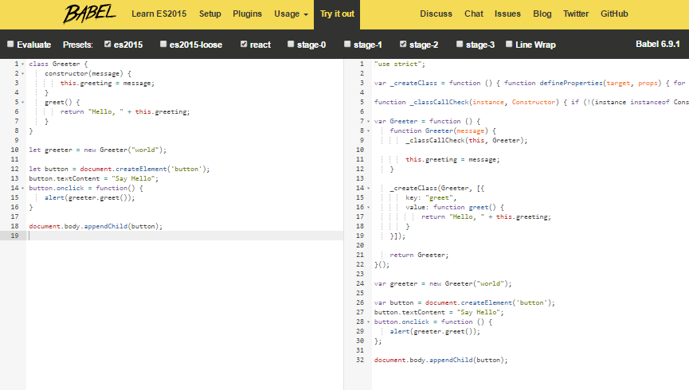
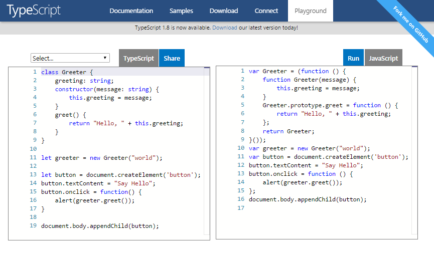

title: ES6, ES7, ES8 - The New New JavaScript / ECMAScript


# The New New JavaScript - What's News?

Q: How many new language feature can you find?

`components/PostList.js`:

```
import React from 'react'
import { Link } from 'react-router'
import { prefixLink } from 'gatsby-helpers'


export default class PostList extends React.Component {
  render () {
    const {posts} = this.props;
    return (
      <ul>
        {posts.map( post => <li><Link to={prefixLink(post.path)}>{post.data.title}</Link></li> )}
      </ul>
    )
  }
}
```


# The New New JavaScript - What's News? (Cont.)

Q: How many new language feature can you find?

A:

- Classes
- Modules
- Arrow Functions
- Destructuring (e.g. Assignment "Shortcuts" with Pattern Matching)
- Let + Const


And much more

- Enhanced Object Literals
- Template Strings
- Unicode
- Default + Rest + Spread
- Iterators + For..Of
- Map + Set + WeakMap + WeakSet
- Symbols (e.g. New Data Type)
- Subclassable Built-ins (e.g. Array, Date, Element, etc.)
- Math + Number + String + Object APIs
- Binary and Octal Literals
- Generators
- Promises
- Proxies
- Reflect API
- And much more


# JavaScript (JS), ECMAScript (ES), ES5, ES6, ES7, ES8, ES2015, ES2016, ES2017

First appeared on May 23, 1995 -- 21 years ago


### Version History

Date Published | Version
---------------|----------
June 1997      | ES1
June 1998      | ES2
Dec  1999      | ES3
-              | ES4 (Fail)
Dec 2009       | ES5
June 2011      | ES5.1
June 2015      | ES6 (also known as ES2015) - code name "Harmony"
June 2016      | ES7 (also known as ES2016)


# New Release Schedule - Every Year A Release

e.g.

- ES2015  -   Release on June 2015
- ES2016  -   Release on June 2016 (Current Version today in 2016)
- ES2017  -   Release on June 2017
- ES2018  -   Release on ??
- and so on

What gets included? Depends if ready or not (e.g. stage 0-4) e.g.

- stage-0 - Strawman: just an idea.
- stage-1 - Proposal: this is worth working on.
- stage-2 - Draft: initial spec.
- stage-3 - Candidate: complete spec and initial browser implementations.
- stage-4 - Finished: will be added to the next yearly release.

(Source: [The TC39 Process](https://tc39.github.io/process-document/))


# What's Next? Follow the Technical Committee 39 (TC39)

List of proposals published (tracked) on GitHub (using `tc39` org) in the
[`/propsals`](https://github.com/tc39/proposals) repo:

- [Stage 1 and Above Proposals](https://github.com/tc39/proposals)
- [Stage 0 Proposals](https://github.com/tc39/proposals/blob/master/stage-0-proposals.md)
- [Inactive Proposals](https://github.com/tc39/proposals/blob/master/inactive-proposals.md)


# ES6 (ES2015) - Can I Use ___ ? - Browser Support Matrix

- Microsoft Internet Explorer (IE) 11  - 15%
- Microsoft Edge 14  - 90%
- Mozilla Firefox 49 - 93%
- Google Chrome 52 - 98%
- Apple Safari 10  - Surprise (!) - 100%

(Source: [ES6 Compatibility Table](http://kangax.github.io/compat-table/es6/), Jul/2016)




# Try Babel (REPL) - ES6 to ES5

[babeljs.io/repl](http://babeljs.io/repl/)




# Try TypeScript (REPL) - TypeScript to ES3

[typescriptlang.org/play](https://www.typescriptlang.org/play/)




# ES6 Examples


# ES6 Examples - #1 Modules

Language-level support for modules for component definition. Codifies patterns
from popular JavaScript module loaders (AMD, CommonJS). Runtime behaviour
defined by a host-defined default loader. Implicitly async model – no code
executes until requested modules are available and processed.

```js
// lib/math.js
export function sum(x, y) {
  return x + y;
}
export var pi = 3.141593;
```
```js
// app.js
import * as math from "lib/math";
console.log("2π = " + math.sum(math.pi, math.pi));
```
```js
// otherApp.js
import {sum, pi} from "lib/math";
console.log("2π = " + sum(pi, pi));
```

Some additional features include `export default` and `export *`:

```js
// lib/mathplusplus.js
export * from "lib/math";
export var e = 2.71828182846;
export default function(x) {
    return Math.exp(x);
}
```
```js
// app.js
import exp, {pi, e} from "lib/mathplusplus";
console.log("e^π = " + exp(pi));
```

(Source: [Learn ES2015](http://babeljs.io/docs/learn-es2015))


# ES6 Examples - #2 Classes

ES2015 classes are a simple sugar over the prototype-based OO pattern.  Having a
single convenient declarative form makes class patterns easier to use, and
encourages interoperability.  Classes support prototype-based inheritance, super
calls, instance and static methods and constructors.

```js
class SkinnedMesh extends THREE.Mesh {
  constructor(geometry, materials) {
    super(geometry, materials);

    this.idMatrix = SkinnedMesh.defaultMatrix();
    this.bones = [];
    this.boneMatrices = [];
    //...
  }
  update(camera) {
    //...
    super.update();
  }
  static defaultMatrix() {
    return new THREE.Matrix4();
  }
}
```

(Source: [Learn ES2015](http://babeljs.io/docs/learn-es2015))


# ES6 Examples - #3 Subclassable Built-ins

In ES2015, built-ins like `Array`, `Date` and DOM `Element`s can be subclassed.

```js
// User code of Array subclass
class MyArray extends Array {
    constructor(...args) { super(...args); }
}

var arr = new MyArray();
arr[1] = 12;
arr.length == 2
```

(Source: [Learn ES2015](http://babeljs.io/docs/learn-es2015))


# ES6 Examples - #4 Enhanced Object Literals

Object literals are extended to support setting the prototype at construction,
shorthand for `foo: foo` assignments, defining methods and making super calls.
Together, these also bring object literals and class declarations closer
together, and let object-based design benefit from some of the same
conveniences.

```js
var obj = {
    // Sets the prototype. "__proto__" or '__proto__' would also work.
    __proto__: theProtoObj,
    // Computed property name does not set prototype or trigger early error for
    // duplicate __proto__ properties.
    ['__proto__']: somethingElse,
    // Shorthand for ‘handler: handler’
    handler,
    // Methods
    toString() {
     // Super calls
     return "d " + super.toString();
    },
    // Computed (dynamic) property names
    [ "prop_" + (() => 42)() ]: 42
};
```

(Source: [Learn ES2015](http://babeljs.io/docs/learn-es2015))


# ES6 Examples - #5 Map + Set + WeakMap + WeakSet

Efficient data structures for common algorithms.  WeakMaps provides leak-free
object-key’d side tables.

```js
// Sets
var s = new Set();
s.add("hello").add("goodbye").add("hello");
s.size === 2;
s.has("hello") === true;

// Maps
var m = new Map();
m.set("hello", 42);
m.set(s, 34);
m.get(s) == 34;

// Weak Maps
var wm = new WeakMap();
wm.set(s, { extra: 42 });
wm.size === undefined

// Weak Sets
var ws = new WeakSet();
ws.add({ data: 42 });
// Because the added object has no other references, it will not be held in the set
```

(Source: [Learn ES2015](http://babeljs.io/docs/learn-es2015))

# ES6 Examples - #6 Arrows and Lexical This

Arrows are a function shorthand using the `=>` syntax.  They are syntactically
similar to the related feature in C#, Java 8 and CoffeeScript.  They support
both expression and statement bodies.  Unlike functions, arrows share the same
lexical `this` as their surrounding code.

```js
// Expression bodies
var odds = evens.map(v => v + 1);
var nums = evens.map((v, i) => v + i);

// Statement bodies
nums.forEach(v => {
  if (v % 5 === 0)
    fives.push(v);
});

// Lexical this
var bob = {
  _name: "Bob",
  _friends: [],
  printFriends() {
    this._friends.forEach(f =>
      console.log(this._name + " knows " + f));
  }
};
```

(Source: [Learn ES2015](http://babeljs.io/docs/learn-es2015))

# ES6 Examples - #7 Default + Rest + Spread

Callee-evaluated default parameter values. Turn an array into consecutive
arguments in a function call. Bind trailing parameters to an array. Rest
replaces the need for `arguments` and addresses common cases more directly.

```js
function f(x, y=12) {
  // y is 12 if not passed (or passed as undefined)
  return x + y;
}
f(3) == 15
```
```js
function f(x, ...y) {
  // y is an Array
  return x * y.length;
}
f(3, "hello", true) == 6
```
```js
function f(x, y, z) {
  return x + y + z;
}
// Pass each elem of array as argument
f(...[1,2,3]) == 6
```

(Source: [Learn ES2015](http://babeljs.io/docs/learn-es2015))

# ES6 Examples - #8 Let + Const

Block-scoped binding constructs. `let` is the new `var`. `const` is
single-assignment. Static restrictions prevent use before assignment.


```js
function f() {
  {
    let x;
    {
      // okay, block scoped name
      const x = "sneaky";
      // error, const
      x = "foo";
    }
    // okay, declared with `let`
    x = "bar";
    // error, already declared in block
    let x = "inner";
  }
}
```

(Source: [Learn ES2015](http://babeljs.io/docs/learn-es2015))

# ES6 Examples - #9 Destructuring

Destructuring allows binding using pattern matching, with support for matching
arrays and objects.  Destructuring is fail-soft, similar to standard object
lookup `foo["bar"]`, producing `undefined` values when not found.

```js
// list matching
var [a, ,b] = [1,2,3];
a === 1;
b === 3;

// object matching
var { op: a, lhs: { op: b }, rhs: c }
       = getASTNode()

// object matching shorthand
// binds `op`, `lhs` and `rhs` in scope
var {op, lhs, rhs} = getASTNode()

// Can be used in parameter position
function g({name: x}) {
  console.log(x);
}
g({name: 5})

// Fail-soft destructuring
var [a] = [];
a === undefined;

// Fail-soft destructuring with defaults
var [a = 1] = [];
a === 1;

// Destructuring + defaults arguments
function r({x, y, w = 10, h = 10}) {
  return x + y + w + h;
}
r({x:1, y:2}) === 23
```

(Source: [Learn ES2015](http://babeljs.io/docs/learn-es2015))

# ES6 Examples - #10 Template Strings

Template strings provide syntactic sugar for constructing strings. This is
similar to string interpolation features in Perl, Python and more. Optionally, a
tag can be added to allow the string construction to be customized, avoiding
injection attacks or constructing higher level data structures from string
contents.

```js
// Basic literal string creation
`This is a pretty little template string.`

// Multiline strings
`In ES5 this is
 not legal.`

// Interpolate variable bindings
var name = "Bob", time = "today";
`Hello ${name}, how are you ${time}?`

// Unescaped template strings
String.raw`In ES5 "\n" is a line-feed.`

// Construct an HTTP request prefix is used to interpret the replacements and construction
GET`http://foo.org/bar?a=${a}&b=${b}
    Content-Type: application/json
    X-Credentials: ${credentials}
    { "foo": ${foo},
      "bar": ${bar}}`(myOnReadyStateChangeHandler);
```

(Source: [Learn ES2015](http://babeljs.io/docs/learn-es2015))


# JavaScript in Action - Did you know?

- **GitHub Atom** (web: [atom.io](https://atom.io)) is built (coded) in JavaScript (and HTML and CSS) w/ Electron and Node.js

- **Microsoft Visual Studio Code** (web: [code.visualstudio.com](https://code.visualstudio.com)) is built (coded) in JavaScript (and HTML and CSS) w/ Electron and Node.js


# Free ES6 (Online) Books

- You Don't Know JS Series - [**ES6 & Beyond**](https://github.com/getify/You-Dont-Know-JS/tree/master/es6%20%26%20beyond) by Kyle Simpson
- [**Exploring ES6**](http://exploringjs.com) by Axel Rauschmayer
- [**Understanding ES6**](https://github.com/nzakas/understandinges6) by Nicholas C. Zakas
