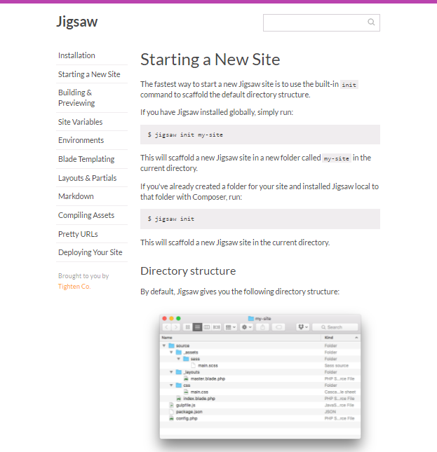

title: Building Static (Web)sites with Jigsaw and Laravel Blade (in PHP)


# Dynamic (Web)Site Generators

**The Biggies** (PHP Rules!)

- WordPress
- Drupal
- Joomla!

On your live production site requires

- database (e.g. mysql)
- application server (e.g. mod_php)
- web server (e.g. apache)

On every request - (re)builds the page on-the-fly e.g. queries the database, runs scripts,
merges templates, etc.


# Static (Web)Site Generators / Builders

On your live production site requires

- web server (e.g. apache, ngnix, etc.) only

- **NO** database needed
- **NO** application server needed

Note: You can even go "server-less" e.g.
host your site on a web service e.g. Amazon S3 (Simple Storage Service).

You build the complete site, that is, **all pages** "ahead-of-time"
on a "build" machine. You will end-up with a bunch of (static) ready-to-use
HTML, CSS and JS files (*). Upload to production site and you're live
w/ a kind of "super cache".

(*) and media files e.g. graphics, music recordings, etc.


# Static (Web)Site Generators / Builders

**The Biggies** in 1999

1. Macromedia Dreamweaver
2. Microsoft FrontPage
3. Netscape Composer

And today?

# Case Study: PHP - The Right Way

**PHP - The Right Way**
(web: [phptherightway.com](http://www.phptherightway.com),
github: [codeguy/php-the-right-way](https://github.com/codeguy/php-the-right-way))

Q: Built with _____?

- [ ] PHP
- [ ] Perl
- [ ] Python
- [ ] Ruby
- [ ] JavaScript (Node.js)


# Case Study: PHP - The Wrong Way

**PHP - The Wrong Way**
(web: [phpthewrongway.com](http://www.phpthewrongway.com),
 github: [binarygenius/phpthewrongway](https://github.com/binarygenius/phpthewrongway))

Q: Built with _____?

- [ ] Lisp
- [ ] OCaml
- [ ] Haskell
- [ ] Reason
- [ ] Elm


# Case Study Answers

PHP - The Right Way is built with...  Ruby (and Jekyll).

**Jekyll** ★26 960 ([jekyllrb.com](http://jekyllrb.com)) - a popular static (web)site builder -
it's built into GitHub and includes free hosting and more.

PHP - The Wrong Way is built with... Haskell (and Pandoc).

**Pandoc** ★7 153 (web: [pandoc.org](http://pandoc.org)) - a popular plain text (e.g. markdown)
to hypertext (e.g. markup) converter
includes templating too - thus, it's another (great) static (web)site builder.


Q: Any static (web)site builders in PHP?


# Hello, Jigsaw!

by Adam Wathan et al (★472) -
web: [jigsaw.tighten.co](http://jigsaw.tighten.co),
github: [`tightenco/jigsaw`](https://github.com/tightenco/jigsaw)




# Why Jigsaw? Why (yet) another static site builder?

Build for Laravel (PHP) developers!

Started in April 2016 (this year) -
see
["Introducing Jigsaw, a Static Site Generator for Laravel Developers"](https://blog.tighten.co/introducing-jigsaw-a-static-site-generator-for-laravel-developers)
by Matt Stauffer (the Laravel lead)

Q: Do you use (know) Laravel's Blade templating language?

A: Yes. Good news. Now use what you know (and PHP)
to build static (web)sites too.


# Why Blade? Why (yet) another PHP template language?

Plain PHP Templates - Isn't PHP the (best) template language?
Does PHP need a (new) template language?

Why Blade?

- Compiled
- "Simpler Syntax"
  - Built-in Template Inheritance
  - (Content) Blocks
  - "Language-Independent" e.g. looks (more) like other popular template languages
  - "Designer-Friendly"

```
@extends('_layouts.master')

@section('body')
    <h1>Hello World!</h1>
@endsection
```


# Getting Started with Jigsaw

Step 1: Install Jigsaw (using Composer)

```
$ composer global require tightenco/jigsaw
```

Step 2: Try it

```
$ jigsaw
```

prints

```
Jigsaw version 0.4.0

Usage:
  command [options] [arguments]

Options:
  -h, --help            Display this help message
  -q, --quiet           Do not output any message
  -V, --version         Display this application version
      --ansi            Force ANSI output
      --no-ansi         Disable ANSI output
  -n, --no-interaction  Do not ask any interactive question
  -v|vv|vvv, --verbose  Increase the verbosity of messages:
                          1 for normal output,
                          2 for more verbose output and
                          3 for debug

Available commands:
  build  Build your site.
  help   Displays help for a command
  init   Scaffold a new Jigsaw project.
  list   Lists commands
```


# Getting Started with Jigsaw Cont. - Commands

- **Init Command**  - Scaffold a new Jigsaw project
- **Build Command** -  Build your site

Try it:

```
$ jigsaw init mysite
```

will produce

```
│   config.php
│   gulpfile.js
│   package.json
└───source/
    │   index.blade.php
    ├───css/
    │       main.css
    ├───_assets/
    │   └───sass/
    │           main.scss
    └───_layouts/
            master.blade.php
```


# Getting Started with Jigsaw Cont. - Commands

```
$ cd mysite
$ jigsaw build
  Site built successfully!
```

will result into:

```
build_local/
│   index.html
└───css/
       main.css
```


# Layouts - Example: layouts/master.blade.php

```
<!DOCTYPE html>
<html>
    <head>
        <title>Your Site Title</title>
    </head>
    <body>
        <header>
            Static Site Sample
        </header>

        @yield('contents')

        <footer>
            <p>Built w/ Jigsaw</p>
        </footer>
    </body>
</html>
```


# Pages in HTML - Example: index.blade.php

```
@extends('_layouts.master')

@section('body')
<h1>Hello world!</h1>
@endsection
```

# Pages in Markdown - Example: about.md

Use `.markdown` or `.md` extension
and start the page with a front matter block (in YAML).


```
---
extends: _layouts.master
section: body
---

Hello, Jigsaw!

Welcome to markdown madness. We hope you **really** enjoy using good old text for writing.

Just type some [markdown](http://en.wikipedia.org/wiki/Markdown)
and Jigsaw (w/ ) will automatically turn it into hypertext markup language (HTML).
*Simple as that.*

> Quote goes here.

A list:

- One
- Two
- Three

Some inline code `to_html` and a preformatted code block:


    <?php echo 'Hello, World!'; ?>


Or try

# Heading 1

## Heading 2

### Heading 3
```


# Pages in Markdown w/ Custom Front Matter - Example: layouts/page.blade.php + history.md

layouts/page.blade.php:

```
@extends('_layouts.master')

@section('body')
    <div class="page">
        <h2>{{ $pageTitle }}</h2>
    </div>
    @yield('page-body')
@endsection
```

history.md:

```
---
extends:   _layouts.page
section:   page-body
pageTitle: The History of Jigsaw
---

Build for Laravel (PHP) developers!

Started in April 2016 (this year) -
see ["Introducing Jigsaw, a Static Site Generator for Laravel Developers"](https://blog.tighten.co/introducing-jigsaw-a-static-site-generator-for-laravel-developers)
by Matt Stauffer (the Laravel lead)
```


# Global site-wide variables - Example: config.php

Add global site-wide variables
to the config.php:

```
<?php

return [
    'site_title' => '"Your Site Title',
];
```

And use like (in templates):

```
<head>
  <title>{{ $site_title }}</title>
</head>
```


# To be continued

And much more.
