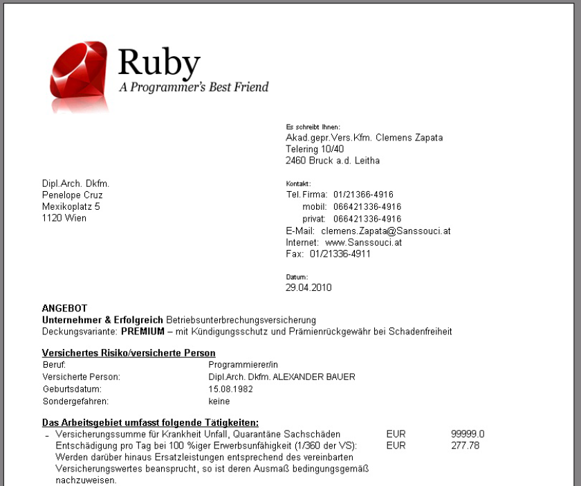
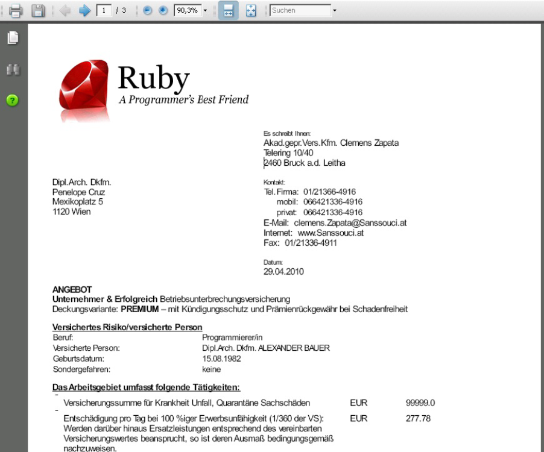

title: (J)Ruby in Action: Generating PDF Documents from HTML Templates

# (J)Ruby in Action: Generating PDF Documents from HTML Templates

## Agenda

* HTML Print Pilot Demo
* HTML Templates w/ Embedded Ruby (Conditions, Loops, Methods)
* Ruby in Action
  * Reading XML Documents Using `xml_simple` Library
  * OpenStructs
  * Open Class Concept
  * `method_missing`
  * Using Embedded Ruby Templates (ERB)
* Ruby in a Java World - `jruby-complete.jar`
* HTML to PDF Conversion
  * `wkhtmltopdf` and Alternatives
  * HTML5 Goodies for Print
  * CSS3 Paged Media and Alternatives
* The End


# Dynlang/Scripting Profile Questions – Ice Breakers

* Are you using any Scripting Languages for Java?
* What? Python? Groovy? Ruby?
* Why? / What for? -> Production? Testing? Configuration? Templates? Other?

<!-- -->

* Bonus: Have you developed a web application in a scripting language on a Java infrastructure/stack?
 (e.g. JRuby on Rails, Google App Engine w/ Groovy, etc.)


Sample:

* Yes / Many
* Ruby, Groovy
* Production, Templates, Testing

<!-- -->

* No / Zero
* 10000 % Java!! Java Rules!! Java Java


# HTML Print Pilot

Idea: Make design of documents as easy as possible

* Use HTML for document templates (use CSS for styling and positioning)
* Use a scripting language for conditions, placeholders, loops, etc. (-> Ruby)


# HTML Print Pilot in Action

Command Line:

    $ jruby print.rb samples/BUFT/BUFT_Angebot_Master.html samples/BUFT/BUFT1.xml > o/BUFT1.html
    $ jruby print.rb samples/BUFT/BUFT_Angebot_Master.html samples/BUFT/BUFT2.xml > o/BUFT2.html

Result:




# HTML to PDF Conversion

    $ wkhtmltopdf --use-print-stylesheet o/BUFT1.html o/BUFT1.pdf

Result:




# HTML Templates Using Embedded Ruby (`erb`) - 1st Impression

Example: `QP_Antrag.html`

```
<ul class="bindestrich">Mein mobiles ServicePaket:</p>
  <li><b>Portal mySanssouci:</b> Jederzeit online Zugriff auf alle Informationen rund
  um meine QualitätsPartnerschaft</li>
  <li><b>Sanssouci Unwetterwarnung:</b> Örtlich und zeitlich exakte Vorhersagen per SMS
  und/oder E-Mail</li>
</ul>

<p>Ich beantrage die QualitätsPartnerschaft und bitte um Verrechnung meiner
Versicherungsverträge, bei denen ich alleiniger Prämienzahler und Verbraucher im Sinne
des Konsumentenschutzgesetzes (KSchG) bin, über das PartnerConto und nehme zustimmend
zur Kenntnis, dass bei Umstellung auf die QualitätsPartnerschaft die Serviceleistungen
aus einem eventuell vorhandenen StarConto, mit Ausnahme der Verrechnungsfunktion für
Verträge von Kooperationsunternehmen, durch die Serviceleistungen der
QualitätsPartnerschaft ersetzt werden.
</p>

<p>Ich beauftrage
  <% if benutzer.geschlecht == 1 %>
    Herrn
  <% end %>
  <% if benutzer.geschlecht == 2 %>
    Frau
  <% end %>
<%= benutzer.titel %> <%= benutzer.vorName %> <%= benutzer.zuName %>
mich als persönlicher Betreuer in sämtlichen Versicherungsangelegenheiten meiner Verträge
des ExklusivVertriebs zu beraten, zu betreuen und zu unterstützen. Ich ermächtige sie/ihn
hiermit gleichzeitig, alle dafür relevanten Vertrags- und Schadendaten in meinem Namen
zu erheben bzw. in diese Einsicht zu nehmen.</p>
```

# Why Ruby? Why Not Groovy?

Ruby Pros:

* Write Ruby Once, Runs Anywhere! .Net Runtime – Yes, Java Runtime – Yes, C-Runtime – Yes
* Easier To Use and Learn for Non-Java Programmers (e.g. Casual Developers such as Designers/Analysts)
* Better Documentation (More Books, etc.)
* More Innovations (Different Culture – Enterprise-y? Ethos -Programmer Happiness, Simple, etc.)
* Works Great as Template Language e.g. for Web Views (No `{}`, method `()` optional, etc.)
* Better Meta-Progamming
* Much More!

Groovy Pros:

* Better Java Integration
* Easier To Use and Learn for Java Programmers


# HTML Templates – Conditions, Loops

Conditions (`if`):

```
<% if o.sparten.registrierungUnwetter.vorhanden? %>
  <td style="text-align: right">ja</td>
<% else %>
  <td style="text-align: right">nein</td>
<% end %>
```


Loops (`each`):

```
<% o.vertraegeUntergeordnet.each do |qpsub| %>
  <tr>
    <td><%= qpsub.vereinbarungQP.status %></td>
    <td><%= qpsub.vereinbarungQP.polizzenNr %></td>
    <td><%= qpsub.vereinbarungQP.antragsID %></td>
    <td><%= qpsub.vereinbarungQP.prodkurzname %></td>
    <td><%= qpsub.vereinbarungQP.praemieAlt %></td>
    <td><%= qpsub.vereinbarungQP.praemieNeu %></td>
    <td><%= qpsub.vereinbarungQP.praemieDiff %></td>
  </tr>
<% end %>
```

# HTML Templates – Macros, Functions

Definition:

```
<%
def vertragVorhanden?
  o.vertraegeUntergeordnet.each do |v|
    vQP = v.vereinbarungQP
    if vQP.markierungCode == 1 || vQP.markierungCode == 2
      return true
    end
  end
  false
end
%>
```

Usage:

```
<% if vertragVorhanden? %>
  <b>Verträge/Anträge, die nur über das PartnerConto verrechnet werden und nicht zur
  Bereichswertung zählen</b><br />
  (alle Prämien in EUR, inkl. Steuern, exkl. motorbezogener Versicherungssteuer)
<% end %>
```

# Easy XML Data Access Using Dot-Notation

## Access XML Data using Dot-Notation (C-Struct-Like):

```
o.besondereHinweise
o.sparten.registrierungUnwetter.registrierungMobil.firma
```

## Define Short-Cuts:

```
sparten = o.vereinbarung.sparten
vn = sparten.versichertePersonBuft.vereinbarungZuPartner.find{ |v| v.zuordnungsTyp == 1801 }.partner
pz = vn
```

## Using Short-Cuts:

```
vn.hauptWohnsitz.strasse
pz.bankverbindungen.bankKontoNr
```

## Arrays:

```
vn.kuvPartnerInnen[0].vertriebsKuv.kundenverbindung.vtbSchiene
```


# Ruby in Action - Reading XML Documents Using `xml_simple` Library

XML Source:

```
<SystemMandant value="" type="java.lang.Object" desc="null">
  <vereinbarung value="" type="java.lang.Object" desc="null">
    <systemKlasse value="" type="java.lang.Object" desc="null">
      <vpmsModellVersNr value="20100312" type="java.lang.Object" desc="null">
      </vpmsModellVersNr>
    </systemKlasse>
    <vereinbarungTyp value="163" type="java.lang.Object" desc="null">
    </vereinbarungTyp>
    <sparten value="" type="java.lang.Object" desc="null">
      <versichertePersonBuft value="" type="java.lang.Object" desc="null">
        <vereinbarungZuPartner value="" type="java.lang.Object" desc="null">
  <partner value="" type="java.lang.Object" desc="null">
    <geburtsDatum value="12.11.1970" type="java.lang.Object" desc="null">
    </geburtsDatum>
    <geschlecht value="2" type="java.lang.Object" desc="null">
      <choice>
        <item key="0" value="Organisation"/>
        <item key="1" value="männlich"/>
        <item key="2" value="weiblich"/>
      </choice>
    </geschlecht>
    <berufsTitel value="" type="java.lang.Object" desc="null">
      <choice>
        <item key="44" value="Dipl.Arch. Dkfm."/>...
      </choice>
    </berufsTitel>
    <berufsTitelZwei value="" type="java.lang.Object" desc="null">
      ...
    </berufsTitelZwei>
    <hauptWohnsitz value="" type="java.lang.Object" desc="null">
      ...
```


Ruby Code – `xml_simple` Library in Action:

```
# step 1: read xml soruce into memory as string

  xml = File.read( 'samples/BUFT/BUFT1.xml' )

# step 2: parse xml using XmlSimple Lib (result stored in variable @o)

  @o = XmlSimple.xml_in( xml )

# step 3: pretty print (dump) internal structure

  pp @o
```


Internal Structure (JSON-like; just Values, Arrays and Hashes):

```
{"value"=>"",
  "type"=>"java.lang.Object",
  "desc"=>"null",
  "vereinbarung"=>
    {"value"=>"",
     "type"=>"java.lang.Object",
     "desc"=>"null",
     "systemKlasse"=>
      {"value"=>"",
       "type"=>"java.lang.Object",
       "desc"=>"null",
       "vpmsModellVersNr"=>
        {"value"=>"20100312",
         "type"=>"java.lang.Object",
         "desc"=>"null",
         "text"=>"\n\t\t\t"}},
     "vereinbarungTyp"=>
      {"value"=>"163",
       "type"=>"java.lang.Object",
       "desc"=>"null",
       "text"=>"\n\t\t"},
     "sparten"=>
      {"value"=>"",
       "type"=>"java.lang.Object",
       "desc"=>"null",
       "versichertePersonBuft"=>
        {"value"=>"",
         "type"=>"java.lang.Object",
         "desc"=>"null",
         "vereinbarungZuPartner"=>
          [{"index"=>"0",
            "value"=>"",
            "type"=>"java.lang.Object",
            "desc"=>"null",
            "partner"=>
             {"index"=>"0",
              "value"=>"",
              "type"=>"java.lang.Object",
              "desc"=>"null",
              "geburtsDatum"=>
               {"index"=>"0",
                "value"=>"12.11.1970",
                "type"=>"java.lang.Object",
                "desc"=>"null",
                "text"=>"\n\t\t\t\t\t\t"},
                "geschlecht"=>
                 {"index"=>"0",
                  "value"=>"2",
                  "type"=>"java.lang.Object",
                  "desc"=>"null",
                  "choice"=>
                   {"item"=>
                     [{"key"=>"0", "value"=>"Organisation"},
                      {"key"=>"1", "value"=>"m\303\244nnlich"},
                      {"key"=>"2", "value"=>"weiblich"}]}},
                "berufsTitel"=>
                 {"index"=>"0",
                  "value"=>"",
                  "type"=>"java.lang.Object",
                  "desc"=>"null",
                  "choice"=>
                   {"item"=>
                     [{"key"=>"44", "value"=>"Dipl.Arch. Dkfm."},
```

Allows Access Using Hash:

```
@o['vereinbarung']['systemKlasse']['vmpsModellVersNr']['value'] => 20100312
@o['vereinbarung']['sparten']['versichertePersonBuft']['vereinbarungZuPartner']['partner']['geburtsDatum'] => 12.11.1970
```


# Ruby in Action – OpenStructs – Easy Dot Access

Convert Hash Access to Dot Access Using OpenStructs

Classic Access using Hash Access:

```
@o['vereinbarung']['systemKlasse']['vmpsModellVersNr']['value'] => 20100312
@o['vereinbarung']['sparten']['versichertePersonBuft']['vereinbarungZuPartner']['partner']['geburtsDatum'] => 12.11.1970
```

Easy Dot-Access using OpenStruct:

```
@o.vereinbarung.systemKlasse.vmpsModellVersNr.value => 20100312
@o.vereinbarung.sparten.versichertePersonBuft.vereinbarungZuPartner.partner.geburtsDatum => 12.11.1970
```

What is an OpenStruct?

Usage:

```
hash = { "key"=>"0", "value"=>"Organisation" }
item = OpenStruct.new(hash)
item.key => "0"
item.value => "Organisation"
```


# Ruby in Action – Open Class Concept – Extend Existing Classes

Let's make the conversion recursive (that is, for complete parsed data tree):

```
class Object
  def to_openstruct
    self
  end
end

class Array
  def to_openstruct
    map{ |el| el.to_openstruct }
  end
end

class Hash
  def to_openstruct
    mapped = {}
    each{ |key,value| mapped[key.to_s] = value.to_openstruct }
    OpenStruct.new(mapped)
  end
end
```


That’s it. Usage:

```
@o = @o.to_openstruct
```

# Ruby in Action - `method_missing` - Accessing Non-Existing Fields

Accessing Non-Existing Fields in OpenStruct:

```
class MyOpenStruct
  def initialize( hash )
    @hash = hash
  end
  ...
  def method_missing(mn,*a)
    mn = mn.to_s
    if @hash.has_key?(mn)
      @hash[mn]
    else
      STDERR.puts "*** warning: field '#{mn}' not found in hash; returning OpenStructNil"
      MyOpenStructNil.new( self, mn )
    end
  end
```

Accessing Non-Existing Fields in Non-Existing Hash:

```
class MyOpenStructNil
  def initialize( parent, field )
    @parent = parent
    @field = field
  end
  ...
  def method_missing(mn,*a)
    mn = mn.to_s
    STDERR.puts "*** warning: field '#{mn}' not found (parent is nil)"
    MyOpenStructNil.new( self, mn )
   end
```


# Ruby in Action - Using Embedded Ruby Templates (ERB)

```
# step 1: read template source into memory as string
  
  rhtml = File.read( 'samples/BUFT/BUFT_Master.html' )

# step 2: make string into a template object

  template = ERB.new( rhtml )

# step 3: merge (fill in) template using variables from binding

  result = template.result( binding() )

# step 4: write out results in new file

  File.open( 'o/BUFT1.html', 'w') {|f| f.write( result ) }
```


# Ruby in a Java World - `jruby-complete.jar`

Command Line:

    $ jruby print.rb samples/BUFT/BUFT_Angebot_Master.html samples/BUFT/BUFT1.xml > o/BUFT1.html

Using jruby-complete.jar:

    $ java -jar jruby-complete.jar print.rb samples/BUFT/BUFT_Angebot_Master.html samples/BUFT/BUFT1.xml > o/BUFT1.html

What is `jruby-complete.jar`?

* All-in-one Java-Archive (jar) for JRuby (also includes Ruby standard libs plus some extras).
* No installation needed; just add `jruby-complete.jar` to your classpath.


# HTML to PDF Conversion - `wkhtmltopdf`

What is `wkhtmltopdf?`

* Open Source C++ Code
* Builds on Qt Library and WebKit (`wk`)
* Adds some extras for page breaking, headers & footers, table of contents, etc.

[More Info](http://code.google.com/p/wkhtmltopdf), [Source](https://github.com/antialize/wkhtmltopdf)

Example:

    $ wkhtmltopdf --use-print-stylesheet o/BUFT1.html o/BUFT1.pdf


# HTML to PDF Conversion – Options/Alternatives

**HTML/CSS Parser using iText API** - Flying Saucer - 100 % Java (Open Source) - [More Info](http://code.google.com/p/flying-saucer), [Article](http://today.java.net/pub/a/today/2007/06/26/generating-pdfs-with-flying-saucer-and-itext.html)

**HTML to FO** (using XSLT-Templates)

**HTML plus CSS3 (plus Paged Media!)** - PrinceXML (Commercial, $3000/license) - [More Info](http://princexml.com)


# HTML5 Goodies for Print

CSS3:

* @font-face
* multi columns
* table layout using CSS
* backgrounds, gradients
* much more

SVG:

* Scalable Vector Graphics (SVG)

CSS3 Paged Media Module:

* Not (yet) supported in any browser (planned for Google Chromium Milestone 6!)
* Supported by commercial HTML to PDF converter (PrinceXML)

What is the CSS3 Page Media Module About?

* Page Breaking
* Page Layout (Headers, Footers, Size)
* Page Counter
* And More

Example:

```
@page {
  size: 210mm 297mm; /* A4 */
  margin: 27mm 16mm 27mm 16mm; /* top, right, bottom, left */
}
@page :left {
  @top-left {
    content: "HTML Print Pilot";
  }
  @bottom-left {
   content: counter(page);
  }
}
@page :right {
  @top-right {
   content: string(header);
  }
}
```

[More Info](http://www.w3.org/TR/css3-page), [Article](http://www.alistapart.com/articles/boom)


# CSS3 Paged Media Alternative - Use JavaScript

* Use JavaScript for Breaking Document into Pages (Pagination)
* Use JavaScript for Adding Headers & Footers to Pages and Replace Place Holders such as `{page}`/`{pages}`


In HTML Print Pilot less than 100 lines of JavaScript (using jQuery Library)

Page Breaking Plus Adding Headers & Footers:

```
var pages = 1; // page counter
var runHeight = 0; // in pixel
var pageHeight = 580; // in pixel

// find header and footer
var header = $('.kopf:first');
var footer = $('.fuss:first');

var buildAll    = $( "<div id='seiten'></div>" );
var buildPage   = buildNewPage( header, footer ).appendTo( buildAll );
var buildAntrag = buildPage.find( '.angebot:first' );

$( '.angebot' ).children().each( function() {
  var width = $(this).width();
  var height = $(this).height();

  debug( runHeight + ' - tag:' + this.tagName + '['+ width + ' x ' + height +']' );

  if( (runHeight+height) > pageHeight )
  {
    debug( '** adding page break' );
    runHeight = 0;
    pages += 1;
    buildAll.append( "<div class='break'></div>" );
    buildPage = buildNewPage( header, footer ).appendTo( buildAll );
    buildAngebot = buildPage.find( '.angebot:first' );
  }
  runHeight += height;
  buildAngebot.append( $(this).clone() );
});
```

Replace Variables/Place Holders in Headers & Footers:

```
var page = 1;
buildAll.find( '.seitea4' ).each( function() {
  debug( '** processing page ' + page + '/' + pages );
  var header = $(this).find( '.kopf:first' );
  var footer = $(this).find( '.fuss:first' );
  header.html( header.html().replace( '{{page}}', page ).replace( '{{pages}}', pages ) );
  footer.html( footer.html().replace( '{{page}}', page ).replace( '{{pages}}', pages ) );
  page += 1;
});
```

# The End - Q&A – Thanks


# Ruby Books

Ruby:

* Programming Ruby 1.9: The Pragmatic Programmers’ Guide, by Dave Thomas, Chad Fowler, and Andy Hunt, 2009
* The Ruby Programming Language by David Flanagan (O’Reilly), 2008
* Ruby Cookbook (O’Reilly), by Lucas Carlson and Leonard Richardson 2006
* Practical Ruby Gems by David Berube (Apress), 2007
* Many Others

JRuby (Ruby Meets Java):

* Using JRuby: Bringing Ruby to Java by Charles O Nutter, Thomas Enebo, Nick Sieger, Ola Bini, and Ian Dees, 2010
* JRuby Cookbook (O’Reilly) by JRuby Cookbook by Justin Edelson and Henry Liu, 2008


# Getting Started - Installing JRuby - 1-2-3 Steps

1. Download and unzip JRuby archive from `jruby.org/download`
2. Set `JRUBY_HOME` environment variable
3. Add `%JRUBY_HOME%/bin` to `PATH`


# Hello Ruby

```
$ jruby -v

=> jruby 1.5.0 (ruby 1.8.7 patchlevel 249) (2010-05-12 6769999) (Java HotSpot(TM) Client VM 1.6.0_14) [x86-java]

$ jruby -S gem list

=> *** LOCAL GEMS ***
=>
=> columnize (0.3.1)
=> rake (0.8.7)
=> rspec (1.3.0)
=> ruby-debug (0.10.3)
=> ruby-debug-base (0.10.3.2)
=> sources (0.0.1)

$ jruby -e "puts 'Ruby Meets Java'"

=> Ruby Meets Java
```

hello.rb:

```
puts 'Ruby Meets Java'

$ jruby hello.rb

=> Ruby Meets Java
```


