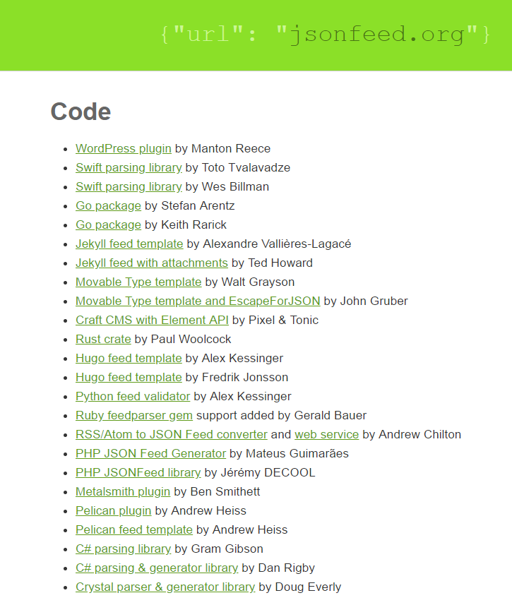
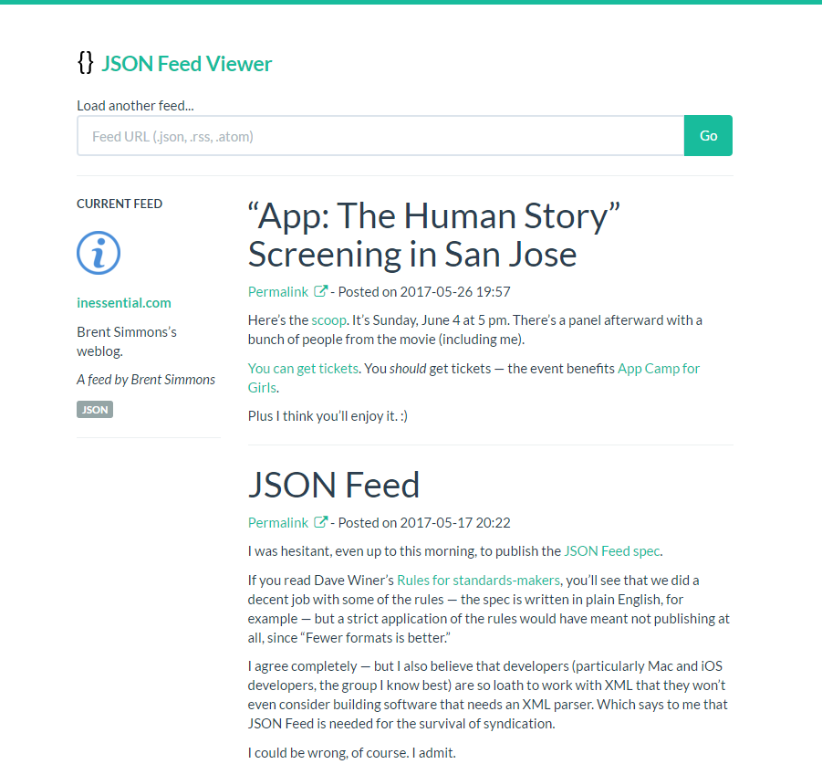
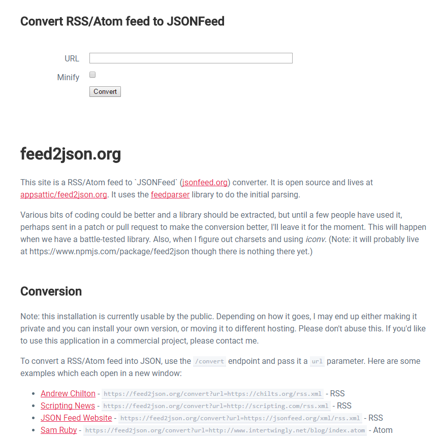
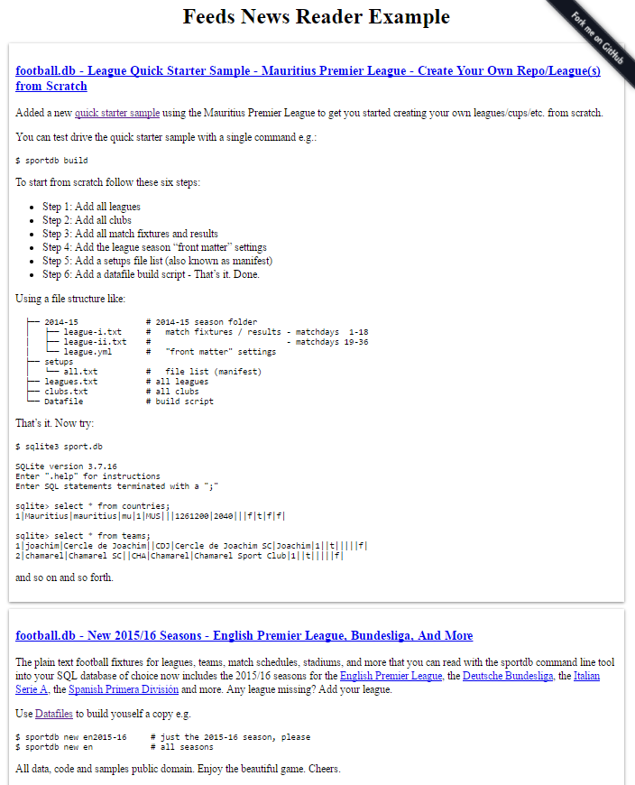

title: Meet Jason Feed - The New Web Feed & Syndication Guy


# The Future of Online News - The Future of Facebook & Co

- How do you read your news?
  - On your computer?
  - On your mobile phone?
  - In your browser?
  - In an app?

- How many websites do you read?
  - One (just Facebook ;-) or Krone)
  - Two or three
  - More than ten
  - More than a hundred


# Triva Quiz - What's RSS?

- [ A ] RDF Site Summary
- [ B ] Rich Site Summary
- [ C ] Really Simple Syndication

RDF = Resource Description Framework


# Content Modeling is Easy - Jason Fried? I know that guy.


([Source: twitter.com/jasonfried/status/865767227416612864](https://twitter.com/jasonfried/status/865767227416612864))


in JSON

```
{
  "author":         { "name": "Jason Fried" },
  "content_text:    "JSON Feed? I know that guy.",
  "date_published": "2017-05-19T20:12:00-00:00",
  "url":            "https://twitter.com/jasonfried/status/865767227416612864"
}
```

- No title.
- No hypertext (markup language) - just plain (vanilla) text.


# Content Modeling is Easy - League Quick Starter Sample - Mauritius Premier League

```
---
title:  "football.db - League Quick Starter Sample - Mauritius Premier League - Create Your Own Repo/League(s) from Scratch"
---

Added a new [quick starter sample](https://github.com/sportkit/mu-mauritius)
using the Mauritius Premier League to get you started creating
your own leagues/cups/etc. from scratch.

You can test drive the quick starter sample with a single command e.g.:

    $ sportdb build


To start from scratch follow these six steps:

- Step 1: Add all leagues
- Step 2: Add all clubs
- Step 3: Add all match fixtures and results
- Step 4: Add the league season "front matter" settings
- Step 5: Add a setups file list (also known as manifest)
- Step 6: Add a datafile build script - That's it. Done.

Using a file structure like:
...
```

([Source: openfootball.github.io/2015/08/30/league-quick-starter ](http://openfootball.github.io/2015/08/30/league-quick-starter))


# Content Modeling is Easy - League Quick Starter Sample - Mauritius Premier League (Cont.)

in JSON
```
{
  "title": "football.db - League Quick Starter Sample - Mauritius Premier League - Create Your Own Repo/League(s) from Scratch",
  "content_html": "<p>Added a new <a href=\"https://github.com/sportkit/mu-mauritius\">quick starter sample</a> \nusing the Mauritius Premier League to get you started creating \nyour own leagues/cups/etc. from scratch.</p>\n\n<p>You can test drive the quick starter sample with a single command e.g.:</p>\n\n<pre class=\"highlight\"><code>$ sportdb build \n</code></pre>\n\n<p>To start from scratch follow these six steps:</p>\n\n<ul>\n  <li>Step 1: Add all leagues</li>\n...",
  "url": "http://openfootball.github.io/2015/08/30/league-quick-starter.html",
  "date_published": "2015-08-30T00:00:00+00:00"
}
```

See [openfootball.github.io/feed.json](http://openfootball.github.io/feed.json)


# Content Modeling is Hard

- What about summary vs full content?
  - Is the content a summary or full content?

- What about plain (vanilla) text vs hypertext (markup language)?
  - How about hypertext in the title or in the summary?
  - How can you tell if the content is plain (vanilla) text or hypertext?

- What about more than one author?
  - How to add the author's email or website or avatar?
  - What about contributors? Is a contributor an author?

- What about ids?
  - Is the url the id?
  - What about global unique ids (guid) or about unique resource names (urn)?


# Meet Jason Feed - A New Feed Format in JSON - feed.json


More [jsonfeed.org](https://jsonfeed.org) »


# Meet Jason Feed - A New Feed Format in JSON - feed.json (Cont.)

```
{
    "version": "https://jsonfeed.org/version/1",
    "title": "Jason Fried's Microblog",
    "home_page_url": "https://micro.blog/jasonfried/",
    "feed_url": "https://micro.blog/jasonfried/feed.json",
    "author": {
        "name": "Jason Fried",
        "url": "https://micro.blog/jasonfried/",
        "avatar": "https://micro.blog/jasonfried/avatar.png"
    },
    "items": [
        {
            "id": "865767227416612864",
            "url": "https://micro.blog/jasonfried/status/865767227416612864",
            "content_text": "JSON Feed? I know that guy.",
            "date_published": "2017-05-19T20:12:00-00:00"
        }
    ]
}
```


#  Rules for Standard Makers - Evolve or Die ;-) - Break Things - Many Worlds Possible

Standards - Standards - Standards  


(Source: [xkcd.com/1179](https://xkcd.com/1179/))


#  Rules for Standard Makers - Evolve or Die ;-) - Break Things - Many Worlds Possible (Cont.)

One (format) to rule them all.
All your base are belong to us.
JavaScript is eating the world ;-)


(Source: [xkcd.com/927](https://xkcd.com/927/))


#  Rules for Standard Makers - Evolve or Die ;-) - Break Things - Many Worlds Possible (Cont.)


[Manifesto: Rules for standards-makers](http://scripting.com/2017/05/09/rulesForStandardsmakers.html)
by Dave Winer - Inventor and Promotor of RSS (0.92, 0.93, 2.0)

One "frozen" format to rule them all (Hint: RSS). Really!?

Lots of great insightful advice, however, what's missing? what's wrong?

Evolve or Die ;-) "Living" standards are the new "everything frozen - we're done forever".
See HTML as an example. Or the English (or German or any) language
including programming languages e.g. JavaScript ;-)

So let's celebrate there are many  worlds and many ways to do it ;-)
and don't be afraid to break things to try new "keep it simpler" ways
e.g. web journal log entry => web journal log => web log => blog.

=> Let's welcome and celebrate JSON Feed!  Finally, feeds in JSON ;-)


# Meet Jason Feed - A New Feed Format in JSON - feed.json (Cont.)

Q: What about plain (vanilla) text vs hypertext (markup language)?

Use `content_text` for text

and `content_html` for hypertext.

No artificial intelligence (AI) needed ;-)


Q: What about summary vs full content?

Use `summary` for summaries

and `content_text` or `content_html` for full content.

Note: "Full" content might just be:

```
"content_text": "Me!"
```


# Why (another) feed format?

JSON is the new XML ;-)  Easier. Free. Simpler.


# Why (another) feed format? - JSON is the new XML ;-) (Cont.)

RSS and Atom feed formats in XML. No "official" JSON versions (§).

Why?

> Goals. After making feeds easier to read and write,
> our second goal is to provide a format that's self-documenting
> and difficult to do wrong.

[(Source: jsonfeed.org/version/1)](https://jsonfeed.org/version/1)

(§) *Breaking News* May/30 - Dave Winer (re)started [rss in json](http://scripting.com/2017/05/30.html#a110554),
see [scripting.com/rss.xml](http://scripting.com/rss.xml), for an example.


# Why (another) feed format? Cont.

More than "just" JSON versions of RSS or Atom.

(I) Made simpler e.g.:

- Everything is plain text and only `content_html` is for hypertext
  e.g. `summary`, `title`, etc. always plain text.
- No `title` required just `content_text` (e.g. used for microposts)
  or `content_html`.

(II) Many (practical) optional additions e.g.:

- Multiple attachments.
- Modern needs such as avatar images, feed icons and favicons,
  and banner and featured images. Feed readers should not have to search
  and scrape to guess at these things.
- A simple way to add extensions.


# Why (another) feed format? Cont.

Feed format sounds boring!? How about:

A Univeral Server-less Head-less Microservice
Content Management HTTP JSON API.

Easy. Free. Simple.


# Add JSON Feed to Your Site

WordPress JSON Feed Plugin. Yes! Jeykyll. Yes! Hugo. Yes!
And many more.

See the [JSON Feed Code Page](https://jsonfeed.org/code):




# JSON Feed in Action - JSON Feed Viewer

[JSON Feed Viewer](https://json-feed-viewer.herokuapp.com) by Maxime Vaillancourt

Browse through fresh feeds, or enter a feed.

Open Source, see [github.com/maximevaillancourt/json-feed-viewer](https://github.com/maximevaillancourt/json-feed-viewer))

- uses Node.js with Express and Pug (formerly Jade) templates




# JSON Feed in Action - RSS or Atom to JSON Feed

[feed2json.org]() by Andrew Chilton

Convert RSS or Atom feed to JSON Feed

Open Source, see
[github.com/appsattic/feed2json.org](https://github.com/appsattic/feed2json.org)

- uses Node.js with Express and feedparser (for RSS/Atom)




# Build Your Own News Web Component w/ React

See the [Feeds News Reader Sample](https://playhtml.github.io/feeds/react) in Action.




# Build Your Own News Web Component w/ React - NewsApp

Step 1: Fetch the JSON feed

```
componentDidMount() {
    const FEED_URL = 'https://openfootball.github.io/feed.json';

    fetch( FEED_URL )
       .then( res => res.json() )
       .then( json => {
               this.setState( { feed: json } );
            });
	}
```

(Source: [github.com/playhtml/feeds/react/src/NewsApp.js](https://github.com/playhtml/feeds/blob/master/react/src/NewsApp.js))


# Build Your Own News Web Component w/ React - Feed

Step 2: Diplay the JSON feed in HTML

```
export default class Feed extends React.Component {

render() {
   // show json feed formatted w/ html template
 const feed = this.props.feed;

 if (!feed) return <div>Loading...</div>;

 return(
    <div className="list">
  		{ feed.items.map( item => (
<div style={{
  padding: 10,
  margin: 10,
  background: 'white',
  boxShadow: '0 1px 5px rgba(0,0,0,0.5)'
}}>
  <div>
    <h3>
       <a href="{item._url}">{item.title}</a>
    </h3>
    <div dangerouslySetInnerHTML={{__html: item.content_html}} />
  </div>
</div>
     )) }
    </div>);
} // render

} // class Feed
```

That's it.

(Source: [github.com/playhtml/feeds/react/src/Feed.js](https://github.com/playhtml/feeds/blob/master/react/src/Feed.js))


# Thanks - Questions? Comments?


# Bonus: JSON Feed Podcast Example

Yes, works "out-of-the-box" for podcasts too.
Use attachments for audio recordings (media files).

```
{
    "version": "https://jsonfeed.org/version/1",
    "user_comment": "This is a podcast feed. You can add this feed to your podcast client using the following URL: http://therecord.co/feed.json",
    "title": "The Record",
    "home_page_url": "http://therecord.co/",
    "feed_url": "http://therecord.co/feed.json",
    "items": [
        {
            "id": "http://therecord.co/chris-parrish",
            "title": "Special #1 - Chris Parrish",
            "url": "http://therecord.co/chris-parrish",
            "content_text": "Chris has worked at Adobe and as a founder of Rogue Sheep, which won an Apple Design Award for Postage. Chris’s new company is Aged & Distilled with Guy English — which shipped Napkin, a Mac app for visual collaboration. Chris is also the co-host of The Record. He lives on Bainbridge Island, a quick ferry ride from Seattle.",
            "content_html": "Chris has worked at <a href=\"http://adobe.com/\">Adobe</a> and as a founder of Rogue Sheep, which won an Apple Design Award for Postage. Chris’s new company is Aged & Distilled with Guy English — which shipped <a href=\"http://aged-and-distilled.com/napkin/\">Napkin</a>, a Mac app for visual collaboration. Chris is also the co-host of The Record. He lives on <a href=\"http://www.ci.bainbridge-isl.wa.us/\">Bainbridge Island</a>, a quick ferry ride from Seattle.",
            "summary": "Brent interviews Chris Parrish, co-host of The Record and one-half of Aged & Distilled.",
            "date_published": "2014-05-09T14:04:00-07:00",
            "attachments": [
                {
                    "url": "http://therecord.co/downloads/The-Record-sp1e1-ChrisParrish.m4a",
                    "mime_type": "audio/x-m4a",
                    "size_in_bytes": 89970236,
                    "duration_in_seconds": 6629
                }
            ]
        }
    ]
}
```

# Bonus: JSON Feed - Who's Who - Meet Brent Simmons n Manton Reece

Brent Simmons? - I know this guy!

Manton Reece? - I know that guy!

Brent Simmons built the NetNewsWire  more than 10+ years ago;
was first (most popular) news reader for Apple Mac OS X.

Blogs at [inessential.com](http://inessential.com)
with [feed.json](http://inessential.com/feed.json) ;-)


Manton Reece builds micro.blog - a timeline and publishing platform for the open web.
Also built the WordPress JSON Feed plugin ;-)

Blogs at [manton.org](http://manton.org) with [feed.json](http://manton.org/feed/json) ;-)


# Bonus: Let's "fix" JSON - What's wrong or missing in JSON 1.0?

- Add comments.
- Allow object keys without quotes.
- Add multi-line strings.
- Allow trailing commas or make commas optional.
- And much much more.

New (working) JSON format proposals include:

- [SON (Simple Object Notation)](https://github.com/aleksandergurin/simple-object-notation)
- [HJSON (Human JSON)](http://hjson.org)
- [JSON5](http://json5.org)
- and others

Why not evolve JSON? Keep it frozen, forever, really?

SON Feed? JSON5 Feed? HJSON Feed? Anyone?
