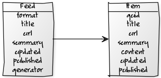
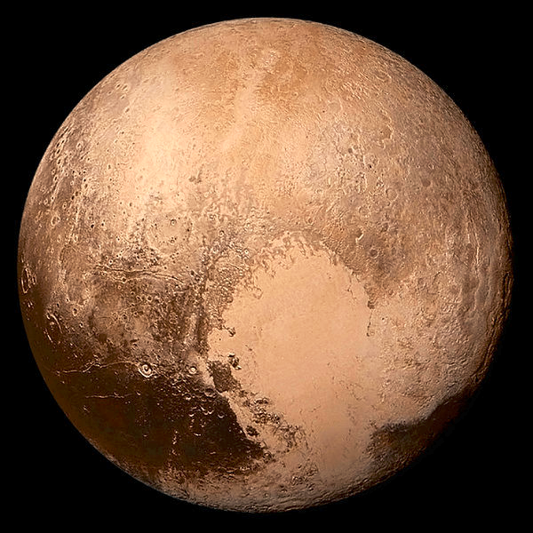
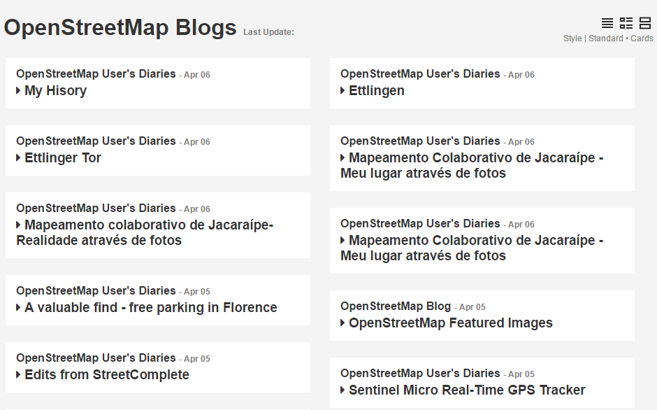
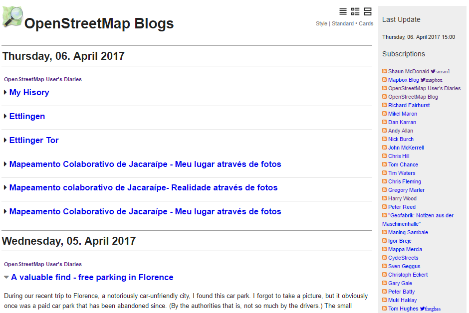
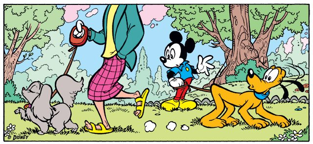
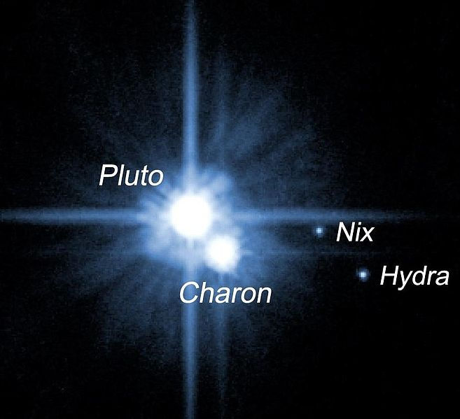

title: New Horizons - Build Your Own (Static) Planet News Site w/ Pluto (and Ruby)


# Agenda

- Lets Build a Planet News Site in Ruby
  - What's a Web Feed?
- Reading Web Feeds in Ruby - Options
  - Module RSS - Standard (Built-In) Web Feed Reader & Writer Library
  - Hello, feedparser gem!
- Planet Feed Reader in 20 Lines of Ruby
- What's Planet Pluto?
  - Planet Ruby - Step 1 - Add Your Web Feeds
  - Planet Ruby - Step 2 - Build Your Planet News Site
- OpenStreetMap Blogs (blogs.openstreetmap.org)
  - Step 1 - Add Your Web Feeds
  - Step 2 - Build Planet News Site
  - How-to Auto-Update Planet News Site Every Hour
  - Design Your Own Templates
- Design Your Own Planet Pluto Templates / Themes
- Planet Pluto - Stay Static or Go Dynamic?
- Jekyll Planet Pluto Addon / Importer
- Bonus
  - Planet Ruby - What's Happening in the Ruby Universe?
  - Planet Pluto - What's Next? Plans & Ideas
  - Tip - Add Profile Pics (Hacker Gotchis)


# Lets Build a Planet News Site in Ruby

What's a web feed?

Example: [xkcd.com/atom.xml](https://xkcd.com/atom.xml)

```
<feed xmlns="http://www.w3.org/2005/Atom" xml:lang="en">
  <title>xkcd.com</title>
  <link href="https://xkcd.com/" rel="alternate"/>
  <id>https://xkcd.com/</id>
  <updated>2017-04-05T00:00:00Z</updated>
  <entry>
    <title>Security Advice</title>
    <link href="https://xkcd.com/1820/" rel="alternate"/>
    <updated>2017-04-05T00:00:00Z</updated>
    <id>https://xkcd.com/1820/</id>
    <summary type="html">
      
    </summary>
  </entry>
  ...
</feed>
```

# Let's Welcome the Microservices Vienna Meetup

What's a web feed?  - Architecture Astronauts Edition ;-)

The Facebook news feed is a centralized monolith!

A planet news feed is a distributed (micro)service architecture!

- Uses publish & subscribe (PubSub) channels
- Uses open formats with hypermedia as the engine of application state (HATEOS)
- Uses evolutionary future forward design   
- Runs on Amazon S3 or other "server-less" storage (micro)services
- 100 % certified representational state transfer (REST) style e.g. works with the web e.g. HTTP, proxies, caches, etc. not yet another abstraction layer or strategy factory
- Free vendor-neutral royalty-free industry standard


# Reading Web Feeds in Ruby - Options

Module RSS - Standard (built-In) web feed reader & writer library.
The doc reads:

> RSS reading and writing

> Really Simple Syndication (RSS) is a family of formats that describe 'feeds,'
> specially constructed XML documents that allow an interested person
> to subscribe and receive updates from a particular web service.
> This portion of the standard library provides tooling to read and create these feeds.
>
> The standard library supports RSS 0.91, 1.0, 2.0, and Atom, a related format.
> Here are some links to the standards documents for these formats:
>
> - RSS
>   - 0.9.1
>   - 1.0
>   - 2.0
> - Atom


# Module RSS - Standard (Built-In) Web Feed Reader & Writer Library

``` ruby
require 'rss'
require 'open-uri'

xml = open( 'https://xkcd.com/atom.xml' ).read

feed = RSS::Parser.parse( xml )

puts "feed.class.name: #{feed.class.name}"

puts "== #{feed.title.content} =="

feed.entries.each do |entry|
  puts "- #{entry.title.content}"
  puts "  (#{entry.link.href})"
  puts
end
```


# Module RSS - Standard (Built-In) Web Feed Reader & Writer Library (Cont.)

Prints:

```
feed.class.name: RSS::Atom::Feed

== xkcd.com ==

- Security Advice
  (https://xkcd.com/1820/)

- Sweet 16
  (https://xkcd.com/1819/)
...
```


# Reading Web Feeds in Ruby - More Options - Why?

What's the difference?

| RSS                   |  ATOM                   |
| --------------------- | ----------------------- |
| `feed.channel.title`  |  `feed.title.content`   |
| `item.title`          |  `entry.title.content`  |
| `item.link`           |  `entry.link.href`      |

Let's built a "universal" uniform reader

| RSS or ATOM           |
| --------------------- |
| `feed.title`          |
| `item.title`          |
| `item.url`            |

and so on.


# Hello, feedparser gem!

A "universal" web feed parser and normalizer (Atom, RSS 2.0, etc.)
library in ruby.

by Gerald Bauer et al (★32) -
gem: [`feedparser`](https://rubygems.org/gems/feedparser),
github: [`feedparser/feedparser`](https://github.com/feedparser/feedparser)




# Reading Web Feeds in Ruby


``` ruby
require 'feedparser'
require 'open-uri'

xml = open( 'https://xkcd.com/rss.xml' ).read
# xml = open( 'https://xkcd.com/atom.xml' ).read

feed = FeedParser::Parser.parse( xml )

puts "feed.class.name: #{feed.class.name}"

puts "== #{feed.title} =="

feed.items.each do |item|
  puts "- #{item.title}"
  puts "  (#{item.url})"
  puts
end
```

# Reading Web Feeds in Ruby (Cont.)

Prints:

```
feed.class.name: FeedParser::Feed

== xkcd.com ==

- Security Advice
  (https://xkcd.com/1820/)

- Sweet 16
  (https://xkcd.com/1819/)
...
```


# Planet Feed Reader in 20 Lines of Ruby

`planet.rb`:

``` ruby
require 'open-uri'
require 'feedparser'
require 'erb'

# step 1) read a list of web feeds

FEED_URLS = [
  'http://vienna-rb.at/atom.xml',
  'http://weblog.rubyonrails.org/feed/atom.xml',
  'http://www.ruby-lang.org/en/feeds/news.rss'
]

items = []

FEED_URLS.each do |url|
  feed = FeedParser::Parser.parse( open( url ).read )
  items += feed.items
end

# step 2) mix up all postings in a new page

FEED_ITEM_TEMPLATE = <<EOS
<%% items.each do |item| %>
  <div class="item">
    <h2><a href="<%%= item.url %>"><%%= item.title %></a></h2>
    <div><%%= item.content %></div>
  </div>
<%% end %>
EOS

puts ERB.new( FEED_ITEM_TEMPLATE ).result
```


# Planet Feed Reader in 20 Lines of Ruby (Cont.)

Run the script:

```
$ ruby ./planet.rb      
```

Prints:

```
<div class="item">
  <h2><a href="http://vienna-rb.at/blog/2016/11/06/picks/">Picks / what the vienna.rb team thinks is worth sharing this week</a></h2>
  <div>
   <h3>6/11 Picks!!</h3>
   <p>In a series on this website we'll entertain YOU with our picks...
 ...
```

# Production-Ready? Real-World Planet Feed Reader? Almost

(1) Cache (Store) Feed Items in Database

e.g. lets you use `items.latest.limit(24)` and so on (SQL queries)

(2) Use Conditional GETs When Fetching Feeds

e.g. use HTTP Header `If-Modified-Since` for last modified dates and `If-None-Match` for etags

(3) Schedule Feed Auto Update Every Hour

e.g. use `rake update`  w/ cron job, for example

And so on. All goodies (and much more) ready for (re)use in pluto gem.


# What's Planet Pluto?  

A [free planet site generator](http://feedreader.github.io) in ruby (Yes!)
that lets you build web pages from published web feeds.

by Gerald Bauer et al (★47) -
gem: [`pluto`](https://rubygems.org/gems/pluto),
github: [`feedreader/pluto`](https://github.com/feedreader/pluto)


# Planet Pluto Trivia Quiz I

Q: The Mass of (Former) Planet Pluto is ... ?

- (A) 7 Earths
- (B) 1 Earth
- (C) 0.01 (1/100) Earth
- (D) 0.002 (1/500) Earth


Pluto Facts - Did you know?

Pluto was discovered in 1930 and the named after the god of the underworld
proposed by a eleven-year-old schoolgirl in Oxford, England,
who was interested in classical mythology.
Thanks Venetia Burney!




# Planet Ruby - Step 1 - Add Your Web Feeds

Example - `planet.ini`:

```
title = Planet Ruby

[rubylang]
  title = Ruby Lang News
  link  = http://www.ruby-lang.org/en/news
  feed  = http://www.ruby-lang.org/en/feeds/news.rss

[rubyonrails]
  title = Ruby on Rails News
  link  = http://weblog.rubyonrails.org
  feed  = http://weblog.rubyonrails.org/feed/atom.xml

[viennarb]
  title = Vienna.rb News
  link  = http://vienna-rb.at
  feed  = http://vienna-rb.at/atom.xml
```


# Planet Ruby - Step 2 - Build Your Planet News Site

Use the `pluto` command line tool and pass in the planet configuration file.
Example:

```
$ pluto build planet.ini
```

This will

1) fetch all feeds listed in `planet.ini` and

2) store all entries in a local database, that is, `planet.db` in your working folder and

3) generate a planet web page, that is, `planet.html` using the blank template pack in your working folder using all feed entries from the local database.

Open up `planet.html` to see your planet web page. Voila!


# Planet Pluto Trivia Quiz II

Q: How big is the (former) planet Pluto
in km (circumference, that is, 2pi × r)?

- (A) 150 000 km
- (B) 40 000 km
- (C) 11 000 km
- (D) 7 000 km

See [Planets @ NASA Solar System](https://solarsystem.nasa.gov/planets/)


# OpenStreetMap Blogs (`blogs.openstreetmap.org`)

[`blogs.openstreetmap.org`](https://blogs.openstreetmap.org)



or




# OpenStreetMap Blogs - Step 1 - Add Your Web Feeds

Example - `planet.ini`

```
title = OpenStreetMap Blogs

[shaun_mcdonald]
  title = Shaun McDonald
  link = http://blog.shaunmcdonald.me.uk/
  feed = http://blog.shaunmcdonald.me.uk/feed/
  twitter = smsm1
[mapbox]
  title = Mapbox Blog
  link = https://www.mapbox.com/blog/
  feed = https://www.mapbox.com/blog/blog.rss
  twitter = mapbox
[osm_diaries]
  title = OpenStreetMap User's Diaries
  link = http://www.openstreetmap.org/diary/
  feed = http://www.openstreetmap.org/diary/rss
...
```

(Source: [gravitystorm/blogs.osm.org/planet.ini](https://github.com/gravitystorm/blogs.osm.org/blob/master/planet.ini))


# OpenStreetMap Blogs - Step 2 - Build Planet News Site

Again use the `pluto` command line tool and pass in the planet configuration file.
Example:

```
$ pluto build planet.ini -t osm -o build
```

What's news?

The `-t/--template` option lets you use your own templates / theme
e.g. use the `osm` template pack.

The `-o/--output` option lets you define the output folder (default to `./`)
and now uses the `./build` folder.


# OpenStreetMap Blogs - How-to Auto-Update Planet News Site Every Hour

Rerun the command:

```
$ pluto build planet.ini -t osm -o build
```

That's it ;-)  The pluto feed fetcher will
use conditional HTTP get requests and content hash checks for web feeds
etc.


# Pluto Trivia Quiz III

Q: Pluto the Pup is the pet of ...?

- (A) Donald Duck
- (B) Daisy Duck
- (C) Mickey Mouse
- (D) Minnie Mouse





# OpenStreetMap Blogs - Design Your Own Templates

Let's welcome embedded ruby (ERB).

Example - `opml.xml.erb`:

```
<opml version="1.1">
  <head>
    <title><%%= site.title %></title>
    <dateModified><%%= site.updated %></dateModified>
    <ownerName>OpenStreetMap</ownerName>
  </head>
  <body>
    <%% site.feeds.each do |feed| %>
    <outline type="rss" text="<%%= feed.title %>"
                        xmlUrl="<%%= feed.url %>"
                        title="<%%= feed.title %>"/>
    <%% end %>
  </body>
</opml>
```

(Source: [gravitystorm/blogs.osm.org/theme/opml.xml.erb](https://github.com/gravitystorm/blogs.osm.org/blob/master/theme/opml.xml.erb))


# Planet Pluto Trivia Quiz IV

Q: Cosmographia Trivia Quiz - How many planets in our system?

- (A) Planet 7 w/ Moon & Sun
  - Moon Mercury Venus Sun Mars Jupiter Saturn
- (B) Planet 9 (I) w/ Pluto
  - Mercury Venus Earth Mars Jupiter Saturn Uranus Neptune Pluto
- (C) Planet 8 w/o Pluto
  - Mercury Venus Earth Mars Jupiter Saturn Uranus Neptune
- (D) Planet 9 (II) w/ Hypothetical Planet X
  - Mercury Venus Earth Mars Jupiter Saturn Uranus Neptune Planet X

Planet Nine Facts - A New Planet?

> Astronomers used mathematics to predict the existence of the object
> they nicknamed "Planet Nine."
>
> "Planet Nine," could have a mass about 10 times that of Earth and
> orbit about 20 times farther from the sun on average than Neptune. It may take between 10,000 and
> 20,000 Earth years to make one full orbit around the sun.

(Source: [Planets @ NASA Solar System](https://solarsystem.nasa.gov/planets/))


# Design Your Own Planet Pluto Templates / Themes


A bunch of planet starter templates / themes @ [`planet-themes`](https://github.com/planet-templates) org.

- Digest
- Hacker
- Forty
- News
- Paper
- Top
- and more


# Planet Pluto - Stay Static or Go Dynamic?

What's Pluto Live?

A collection of (dynamic) web apps (e.g. sinatra, rails, etc.)
using the pluto machinery @ [`plutolive`](https://github.com/plutolive)
incl. live, live.starter, and admin.

`planet.rb`:

```
class Planet < Sinatra::Base

  include Pluto::Models   # Models e.g. Feed, Item, Site, etc.

  get '/' do
    erb :index
  end

end
```

`index.erb`:

```
<%% site.items.latest.limit(24).each do |item| %>

  <div class='item'>

    <h2 class='item-title'>
     <%%= link_to item.title, item.url %>
    </h2>

    <div class='item-content'>
     <%%= item.content %>
    </div>
  </div>

<%% end %>
```

See the [pluto.live.starter](https://github.com/plutolive/pluto.live.starter) repo for more.


# Planet Pluto Trivia Quiz V

Q: What planet scripts do NOT run on ruby?

- (A) Planet Mars -- by Sam Ruby et al
- (B) Planet Venus -- by Sam Ruby et al
- (C) Planet Pluto -- by Gerald Bauer et al
- (D) Planet Uranus -- by Marvin Gülker et al


# One More Thing ;-) - Jekyll Planet Pluto Addon / Importer


Let's you (auto-)add articles / blog posts to your
(static) website. Example:

```
<p>Happy Friday everyone!</p>

<p>The Rails team has just released <a href="http://rubygems.org/gems/rails/versions/5.2.0.rc3">
the third Release Candidate of Rails 5.2.0</a>
today. For an overview of all the major changes in the 5.2 series, please refer
to the <a href="http://edgeguides.rubyonrails.org/5_2_release_notes.html">release notes</a>.</p>
...
```

becomes `_posts/2017-06-13-ann_rails_520rc3_has_been_released.html`:

```
---
title:      "[ANN] Rails 5.2.0.rc3 has been released!"
created_at: 2017-06-13 03:00:00 UTC
autor:      Ruby on Rails Blog
layout:     post
---
<p>Happy Friday everyone!</p>

<p>The Rails team has just released <a href="http://rubygems.org/gems/rails/versions/5.2.0.rc3">
the third Release Candidate of Rails 5.2.0</a>
today. For an overview of all the major changes in the 5.2 series, please refer
to the <a href="http://edgeguides.rubyonrails.org/5_2_release_notes.html">release notes</a>.</p>
...
```


# Thanks

Questions? Comments?


# Planet Pluto Trivia Quiz VI

Q:  How many moons / natural satellites has Pluto?

- (A) 0 - Zero
- (B) 1 - One
- (C) 3 - Three
- (D) 5 - Five


Pluto Facts - Did you know?  Identity Crisis

> Pluto has five known moons: Charon (the largest, with a diameter just over half that of Pluto),
> Styx, Nix, Kerberos, and Hydra.
> Pluto and Charon are sometimes considered a binary system because the barycenter of their orbits
> does not lie within either body. The  International Astronomical Union (IAU) has not formalized
> a definition for binary dwarf planets,
> and Charon is officially classified as a moon of Pluto.

(Source: [Pluto - Wikipedia](https://en.wikipedia.org/wiki/Pluto))





# Bonus:  Planet Ruby - What's News?

- Planet Ruby
  - 150+ Sources; see [`planetruby/sources`](http://planetruby.herokuapp.com/sources)
- Planet Vienna.rb / Austria  -- Relaunch / Update - Why? Why not?


<!-- -->
- Rubyland News                  - by Jonathan Rochkind (runs on rubyland.news rails app)
- Planet Ruby (Deutsch/German)   - by Marvin Gülker (runs on planet uranus script)

<!-- -->
- Ruby Flow  (link blog)
- Ruby Weekly  (newsletter)
- Green Ruby News  (newsletter)


# Bonus: Planet Pluto - What's Next? Plans & Ideas

Some ideas:

- Use Liquid for (Jekyll-Compatible) Templates
- Bundle Pluto Admin into a gem and command line tool (starts a local server e.g. $ `plutoweb`)
- New Planet Config Format - use Awesome Blogs pages in markdown


# Bonus: Tip - Add Profile Pics (Hacker Gotchis)

Lesson from Facebook (Social Networks)?
Add Profile Pics. Example:

Planet Gnome ([`planet.gnome.org`](http://planet.gnome.org)) - First Planet Planet Still Running Today

See [Hackergotchis](http://planet.gnome.org/heads/):


# Planet Pluto Trivia Quiz VII

Q: What is NOT a classification of Pluto?

- (A) King of the Kuiper Belt
- (B) Outer Solar System Object
- (C) Trans-Neptunian Object
- (D) Planet


> I think the whole Solar System joins me in saying,"Good riddance!" to that whiney little ball of ice.
> That trespasser better stop spewing nonsense from those cryovolcanoes of his,
> or I'll kick his night side all the way to Alpha Centauri.
>
> -- Neptune, Pluto Nemesis

(Source: [The Pluto Diaries - confessions of a former ninth planet](http://www.theplutodiaries.com))
