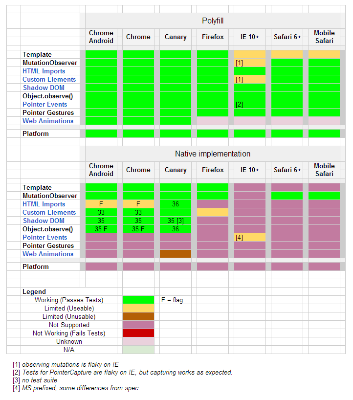
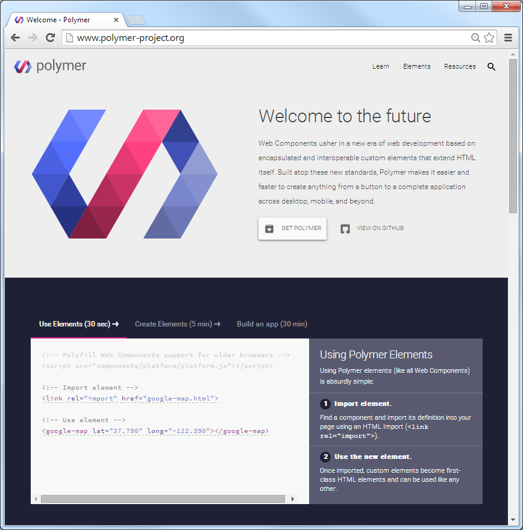

title: Building Your Own Web Components (Tags / Elements)

# Who's this guy?

- **`football.db`** - Open Football Data; see [`github.com/openfootball`](https://github.com/openfootball)
- **`beer.db`**  - Open Beer, Brewery n Brewpub Data; see [`github.com/openbeer`](https://github.com/openbeer)
- **`world.db`** - Open World Data (Countries, Regions, Cities); see [`github.com/openmundi`](https://github.com/openmundi)

# Building Your Own Web Components (Tags / Elements)

Agenda

* What's a custom tag? What's a custom element? What's a web component?
* Web Components Machinery - New Web Standard Building Blocks
* What's X-Tag? What's Polymer?
* Example 1 - `<beer-of-the-day>`  
* Example 2 - `<football-matchday event='at.2014/15'>`

# `<beer-of-the-day>` - Use or Build Your Own Web Component (Tag / Element)

- What's a custom tag?
- What's a custom element?
- What's a web component?

Tag == Element == Web Component
e.g. => `<beer-of-the-day>`, `<football-matchday>`, `<super-button>`

Web components machinery lets you
build your own tags that you can use as easily as plain old `
` or `` tags.

# `<football-matchday>` - Use or Build Your Own Web Component (Tag / Element) - Example

Step 1: Import element definition into your page using an HTML import (`<link rel='import'>`)

~~~
<link rel='import' href='football-matchday.html'>
~~~

Step 2: Use the new element; once imported the new `<football-matchday>` element
is a first-class HTML element; use like any other

~~~
<football-matchday event='at.2014/15'></football-matchday>
~~~

# Trivia Quiz - How many builtin standard elements (tags) has HTML 4.1? HTML 5?

A) --  50+  ?

B) --  100+  ?

C) --  200+  ?

D) --  500+  ?

E) --  1,000+  ?

F) --  10,000+  ?

# All HTML 5 Elements (A-Z)

**A**
`<a>`
`<abbr>`
(x)`<acronym>`
`<address>`
(x)`<applet>`
`<area>`
(5)`<article>`
(5)`<aside>`
(5)`<audio>`
**B**
`<b>`
`<base>`
(x)`<basefont>`
(5)`<bdi>`
`<bdo>`
(x)`<bgsound>`
(x)`<big>`
(x)`<blink>`
`<blockquote>`
`<body>`
` `
`<button>`
**C**
(5)`<canvas>`
`<caption>`
(x)`
`
`<cite>`
`<code>`
`<col>`
`<colgroup>`
**D**
(5)`<data>`
(5)`<datalist>`
`<dd>`
`<del>`
(5)`
`
`<dfn>`
`<dialog>`
(x)`<dir>`
`
`
`<dl>`
`<dt>`
**E**
`<em>`
(5)`<embed>`
**F**
`<fieldset>`
(5)`<figcaption>`
(5)`<figure>`
(x)``
(5)`<footer>`
`<form>`
(x)`<frame>`
(x)`<frameset>`
**G H**
`<h1>`
`<h2>`
`<h3>`
`<h4>`
`<h5>`
`<h6>`
`<head>`
(5)`<header>`
(x,5)`<hgroup>`
`
`
`<html>`
**I**
`<i>`
`<iframe>`
``
`<input>`
`<ins>`
(x)`<isindex>`
**J K**
`<kbd>`
(5)`<keygen>`
**L**
`<label>`
`<legend>`
`<li>`
`<link>`
(x)`<listing>`
**M**
(5)`<main>`
`<map>`
(5)`<mark>`
(x)`<marquee>`
(5)`<menu>`
(5)`<menuitem>`
`<meta>`
(5)`<meter>`
**N**
(5)`<nav>`
(x)`<nobr>`
(x)`<noframes>`
`<noscript>`
**O**
`<object>`
`<ol>`
`<optgroup>`
`<option>`
(5)`<output>`
**P**
`
`
`<param>`
(5)`<picture>`
(x)`<plaintext>`
`<pre>`
(5)`<progress>`
**Q**
`<q>`
**R**
(5)`<rp>`
(5)`<rt>`
(5)`<ruby>`
**S**
`<s>`
`<samp>`
`

    <!-- 2. Load custom tag (e.g HTML Imports in action) -->
    <link rel='import' href='beer-of-the-day.html'>

  </head>
  <body>

    <!-- 3. Use custom tag -->
    <beer-of-the-day></beer-of-the-day>

  </body>
</html>
~~~

# Example 2 - `<football-js>` Bundesliga Matchday Widget

What's `football.js`?

Football widgets in JavaScript using the football.db HTTP JSON(P) API

The old way in JavaScript. Usage Example:

~~~

~~~

The new way:

~~~
<link rel='import' href='football-js.html'>   <!-- HTML Imports -->

<football-js event='at.2013/14'></football-js>  <!-- custom tag use -->
~~~

# Example 2 - `<football-js>` - MDV (Model Driven Views)

### Matchday Data as JavaScript Objects

~~~
{
  "event":{"key":"at.2013/14","title":"Österr. Bundesliga 2013/14"},
  "round":{"pos":2,"title":"2. Runde","start_at":"2013/07/27","end_at":"2013/07/28"},
  "games":[{"team1_title":"SK Rapid Wien","team1_code":"RAP","team2_title":"SC Wiener Neustadt","team2_code":"WRN","play_at":"2013/07/27","score1":4,"score2":0},
           {"team1_title":"FC Admira Wacker","team1_code":"ADM","team2_title":"FC Wacker Innsbruck","team2_code":"FCW","play_at":"2013/07/27","score1":1,"score2":2},
           {"team1_title":"SV Ried","team1_code":"RIE","team2_title":"Wolfsberger AC","team2_code":"WAC","play_at":"2013/07/27","score1":1,"score2":0},
           {"team1_title":"FC RB Salzburg","team1_code":"RBS","team2_title":"FK Austria Wien","team2_code":"AUS","play_at":"2013/07/27","score1":5,"score2":1},
           {"team1_title":"SK Sturm Graz","team1_code":"STU","team2_title":"SV Grödig","team2_code":"SVG","play_at":"2013/07/28","score1":0,"score2":2}]
}
~~~

~~~
<template>
  

    <h3>
      {{{{ data.event.title }}}  -  {{{{ data.round.title }}}
    </h3>
  

</template>
~~~

# Example 2 - `<football-js>` Widget - Nested Templates

~~~
<template>
  

    <h3>
      {{{{ data.event.title }}}}  -  {{{{ data.round.title }}}}
    </h3>

   <table>
   <template repeat='{{{{data.games}}}}'>
   <tr>
    <td>
      {{{{ play_at }}}}
     </td>
     <td style='text-align: right;'>
       {{{{ team1_title }}}} ({{{{ team1_code }}}})
     </td>

     <td>
       {{{{ score1 }}}} - {{{{ score2 }}}}
     </td>
     <td>
      {{{{ team2_title }}}} ({{{{ team2_code }}}})
     </td>
   </tr>
   </template>
   </table>  
</template>
~~~

# Example 2 - `<football-js>` - All Together Now

~~~
<polymer-element name='football-js' attributes='event'>
 
  <template>
   

   

    <h3>
      {{{{ data.event.title }}}}  -  {{{{ data.round.title }}}}
    </h3>

    <table>
   <template repeat='{{{{data.games}}}}'>
   <tr>
    <td>
      {{{{ play_at }}}}
     </td>
     <td style='text-align: right;'>
       {{{{ team1_title }}}} ({{{{ team1_code }}}})
     </td>

     <td>
       {{{{ score1 }}}} - {{{{ score2 }}}}
     </td>
     <td>
      {{{{ team2_title }}}} ({{{{ team2_code }}}})
     </td>
   </tr>
   </template>
    </table>

 

 </template>
  
  
</polymer-element>
~~~

# Example 2 - `<football-js>` - Usage

~~~
<!DOCTYPE html>
<html>
  <head>
    <meta charset='utf-8'>
    <title>football.js</title>
    
    <link rel='import' href='football-js.html'>
  </head>
  <body>
    <football-js event='at.2013/14'></football-js>
  </body>
</html>
~~~

That's it.

# Thanks - Questions? Comments?

## Learn More

- [webcomponents.org](http://webcomponents.org)
- []

HTML5 Rocks Series

- [HTML's New Template Tag: Standardizing client-side templating](http://www.html5rocks.com/en/tutorials/webcomponents/template) by Eric Bidelman (Google); February 26th, 2013 (Updated: December 18th, 2013)
- [Custom Elements: Defining new elements in HTML](http://www.html5rocks.com/en/tutorials/webcomponents/customelements) by Eric Bidelman (Google); August 28th, 2013 (Updated: December 18th, 2013)
- [Shadow DOM 101](http://www.html5rocks.com/en/tutorials/webcomponents/shadowdom) by By Dominic Cooney (Google); January 4th, 2013 (Updated: December 18th, 2013)
- [HTML Imports: #include for the web](http://www.html5rocks.com/en/tutorials/webcomponents/imports) by By Eric Bidelman (Google); November 11th, 2013 (Updated: December 18th, 2013)

# Appendix: Web Components Machinery - New Web Standard Building Blocks - Sources

### Chrome

- [`chrome`]  chrome dashboard (status) link??
- [`chromium.org/blink/web-components`](http://www.chromium.org/blink/web-components)

### Firefox

- bugzilla pages

### Internet Explorer

- [`status.modern.ie`](http://status.modern.ie)

Site source on github (creative commons licensed) build w/ Node.js;
modern IE ?! - is this possible? - IE and modern?

### Apple

- Secrets, Secrets, Secrets - Who knows when or what? 

